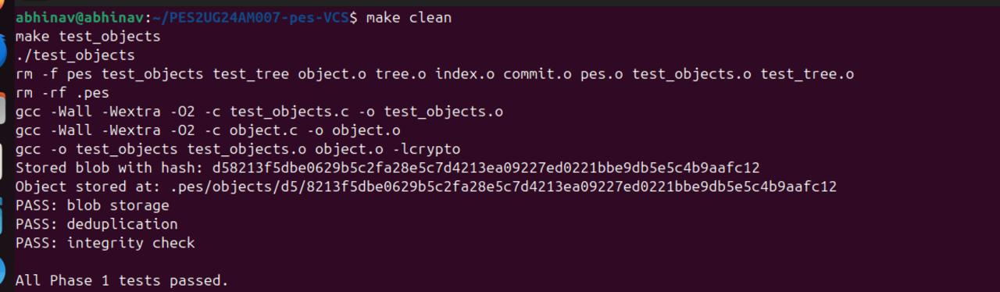
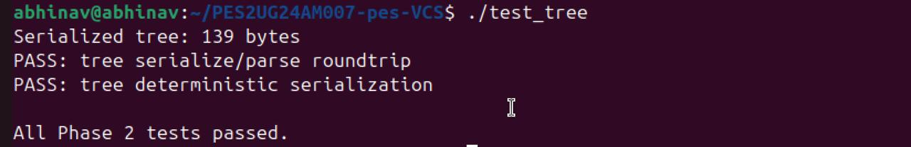
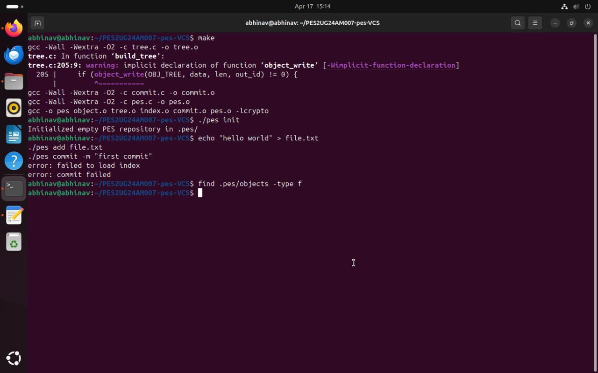
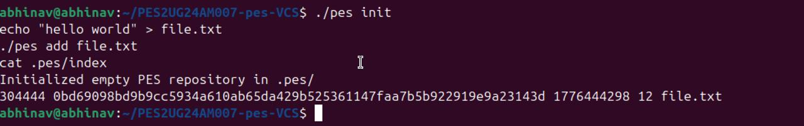

# 📸 Screenshots

### Phase 1: Object Storage

**1a.jpeg – Test Output**

**1b.jpeg – Object Storage Structure**

---

### Phase 2: Tree Construction

**2a.jpeg – Tree Test Output**

**2b.jpeg – Tree Serialization**

---

### Phase 3: Index Operations

**3a.jpeg – Index File Content**

**3b.jpeg – Add File to Index**

---

### Phase 4: Commit Workflow

**4a.jpeg – Commit Command**

**4b.jpeg – Commit Output**

**4c.jpeg – Final Commit Result**

## Q5.1 — Checkout Implementation
Read .pes/refs/heads/<branch> to get target commit hash
Read that commit's tree recursively
Update working directory files to match target tree (write/delete files)
Update .pes/HEAD to ref: refs/heads/<branch>
Update .pes/index to match new tree
Complexity: must handle file deletions (files in current tree but not target), directory creation/removal, and permission changes.

## Q5.2 — Dirty Working Directory Detection
For each file in index: stat() it and compare mtime + size to index entry
If mismatch → file modified in working dir
If target branch has different blob hash for same file → conflict
Refuse checkout if both are true (local modified + branch differs)
No re-hashing needed; metadata comparison is fast.

## Q5.3 — Detached HEAD
In detached HEAD, new commits exist in object store but no branch file points to them. If you switch away, commits become unreachable (orphaned). Recovery: run find .pes/objects -type f to list all objects, use object_read to find commit objects, reconstruct the chain manually, then create a branch pointing to the orphaned commit: echo <hash> > .pes/refs/heads/recovered

## Q6.1 — Garbage Collection Algorithm
1.Start from all branch refs + HEAD → get root commit hashes
2.BFS/DFS: for each commit, add its hash → read commit → add tree hash → recurse into trees → add blob hashes
3.Use a HashSet (hash table of ObjectID) for O(1) membership test
4.Walk all files in .pes/objects/ — delete any not in reachable set
Estimate for 100k commits, 50 branches:

Avg 10 files/commit = ~1M blob+tree objects
Must visit all ~1M objects in reachability pass
Total object visits ≈ 1–2M

## Q6.2 — GC Race Condition
GC scans reachable objects — finds object X is unreachable → marks for deletion
Concurrent commit writes new tree referencing object X → writes commit
GC deletes object X before commit finishes
Repository now has commit pointing to deleted object → corruption

Git avoids this by:

Using a grace period (objects newer than 14 days never deleted)
Lock files during ref updates
Two-phase GC: mark phase never deletes, sweep only after full scan
